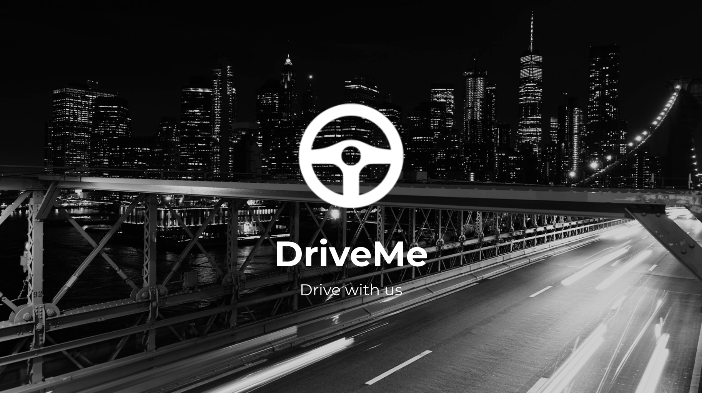
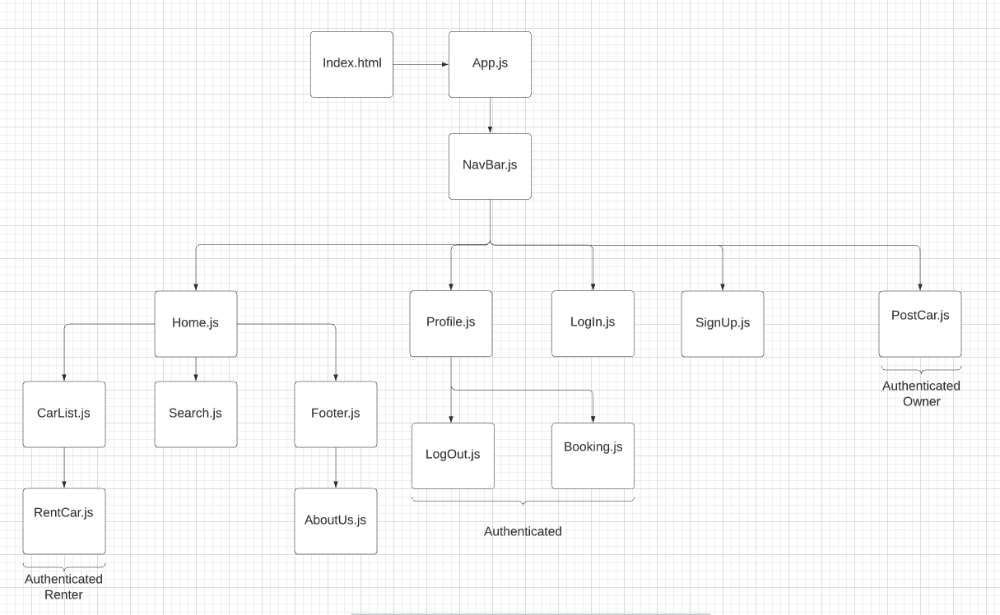
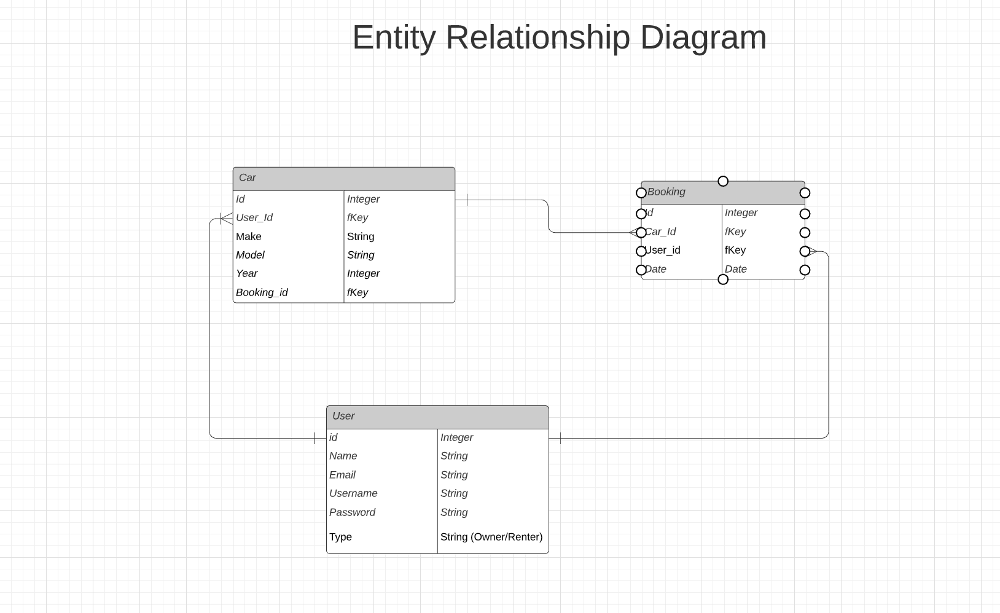

# DriveMe

## Date: 09/20/2021

### Wei Jun Xia   [GitHub]() | [LinkedIn]()
### Derek Valenciano  [Github]() | [LinkedIn]()
### Mustapfa Hydara  [GitHub]() | [LinkedIn]()
### Svetlana Shirapova  [GitHub]() | [LinkedIn]()

***Description***

DriveMe - a full-stack application ...

***Technologies***

* React.js
* Node.js
* Express.js
* PostgreSQL

***Getting Started***

Sign up as a new user...

A Trello board was used to keep track of development progress and can be viewed [here](https://trello.com/b/i35voRC8/group-project).

The project was deployed on Heroku and can be viewed [here]().

***Screenshots***

***Future Updates***

- []
- []
- []

***Credits***