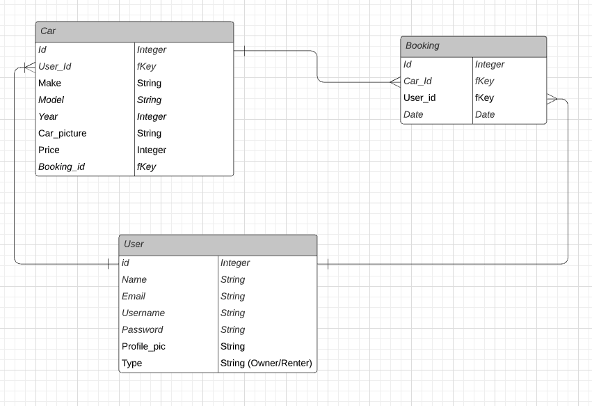

<h1 align="center">DriveMe</h1>

 

## Date: 09/20/2021

#### Wei Jun Xia [GitHub](https://github.com/weijunxia) | [LinkedIn](https://www.linkedin.com/in/w3i/)

#### Derek Valenciano [Github](https://github.com/dvalenciano) | [LinkedIn](https://www.linkedin.com/in/derekvalenciano)

#### Mustapfa Hydara [GitHub](https://github.com/mhydara0624) | [LinkedIn](https://www.linkedin.com/in/mustapfahydara)

#### Svetlana Shirapova [GitHub](https://github.com/SvetLana203) | [LinkedIn](https://www.linkedin.com/in/svetlana-shirapova-aa9068219?)

---

## 🚗 About

DriveMe - a full-stack application built with React.js as front-end, Node.js and Express.js as back-end.
DriveMe is a futuristic no hassle car rental service made to fit modern travel needs.

[Live Demo](https://rocky-journey-81641.herokuapp.com)

  
 

  <h3>Tech Stack</h3>
  

 

## 🚀 Getting Started

Sign up as a new user.

 

## 📊 Component Hierarchy Diagram

 

## 📊 Entity Relationship Diagram

A Trello board was used to keep track of development progress and can be viewed [here](https://trello.com/b/i35voRC8/group-project).

The project was deployed on Heroku and can be viewed [here]().

## 📸 Screenshots

### Home Page

### Register Page

### Signin Page

 

## 🗓 Future Updates

- [ ] Add mapping feature to view vehicle location
- [ ] Import Stripe for efficient checkout service

 

## 📖 Credits

- Material UI
- W3Schools.com
- NPMJS.com
- Tesla.com
- React-Bootstrap
- Google Image Search "Tesla Images"
